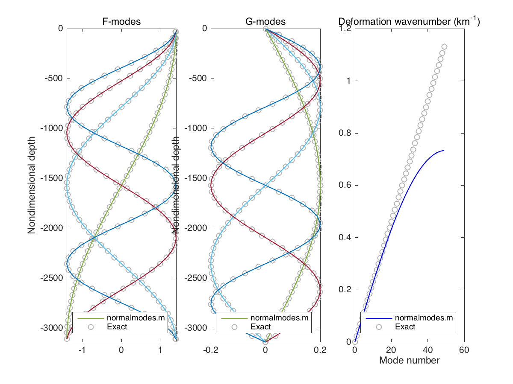
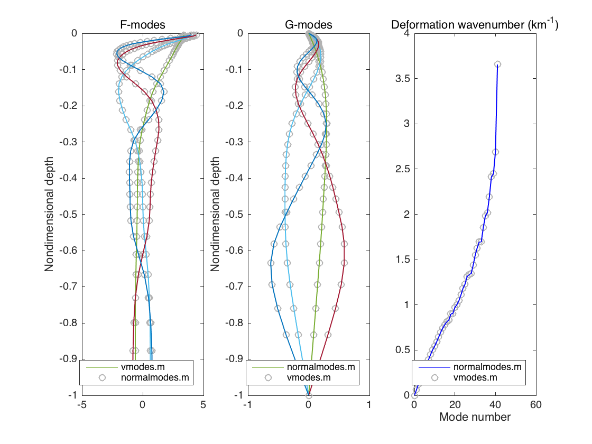

## NORMALMODES

Calculate normal modes from hydrographic or model data.

[TOC]

### Syntax

```
[kd,Gvec,Fvec] = NORMALMODES(dz,rho,F)

Calculate eigenvalues (deformation wavenumbers) and eigenvectors
(normal modes) of the dual Sturm-Liouville problems

    (s*Fm')' = - km^2*Fm,     Fm'(-H) = Fm'(0) = 0
    
    s*Gm'' = - km^2*Gm,       Gm(-H) = Gm(0) = 0

where s = f^2/N^2 and m = 1, 2, ... These are equivalent eigenvalue
problems, as can be seen from the relations

    Gm' = - km*Fm,      s*Fm' = km*Gm. 

Specifically, Gm represents w-like modes (vertical velocity) and Gm
represents psi-like modes (horizontal streamfunction). Note that the
barotropic G-mode is identically zero (G1 = 0) for a rigid lid because the depth-averaged vertical velocity must be zero in that case. By contrast, the barotropic F-mode is simply constant (F1 = 1) for a rigid lid because there can still be a depth-averaged horizontal flow. In either case, the barotropic deformation wavenumber k1 = 0 for a rigid lid. 

The problem is solved by discretizing the vertical second derivative in the Gm equation using the density profile rho(n) and the corresponding  layers of thickness dz(n). The parameter F = f0^2*(L/2*pi)^2/(g'*H0). The vectors Fm are then calculated using Fm = - Gm'/km (plus F1 = 1). 

SEE ALSO: vmodes.m 
```

### Description

#### Sturm-Liouville problem

Solves the dual Sturm-Liouville problems

$$[ s(z) F'_m(z) ]' = - k_m^2 F_m(z), \qquad F'_m(-H) = F'_m(0) = 0,$$

and 

$$s(z) G''_m = - k_m^2 G_m(z), \qquad G_m(-H) = G_m(0) = 0,$$

for $m = 1, 2, \cdots$, where $s(z) = f^2 / N^2$ with Coriolis parameter $f$ and buoyancy frequency $N^2(z) = - g \rho_z / \rho_0$.

These eigenvalue problems are equivalent, as can be seen by the relations

$$G'_m = - k_m F_m, \qquad s(z) F'_m = k_m G_m.$$

The orthogonality relation for the $F_m$ is

$$\langle F_m (z) F_n(z) \rangle = \delta_{mn},$$

where $\langle \cdots \rangle$ represents a vertical average over $-H \le z \le 0$. The corresponding orthogonality condition for the $G_m$ is

$$\langle  G_m(z) G_n(z)  s^{-1}(z) \rangle = \delta_{mn},$$

which can be seen by subsituting $F_n = -k_n^{-2} [s F'_n]'$ into the orthogonality relation for $F_n$, integrating by parts, and making use of $F'_n = k_n G_n / s(z)$. 

Note that the code assumes a rigid lid so that the barotropic mode ($m=1$) will be $F_1 = 1$ and $G_1 = 0$ with $k_1 = 0$. 

#### Non-dimensionalization

We non-dimensionalize vertical scales by $H$, horizontal scales by $L$, and stratification by $N^2_0 = g \overline{\Delta \rho} / \rho_0 H$ where $\overline{\Delta \rho}$ is the average density difference. This gives the following non-dimensional Sturm-Liouville problems on $-1 \le z \le 0$,

$$\mathcal{F} \left[ s(z) F'_m (z) \right] = - k_m^2 F_m (z) \qquad F'_m(-1) = F'_m(0) = 0,$$

$$\mathcal{F} s(z) G''_m (z) = - k_m^2 G_m (z), \qquad G_m(-1) = G_m(0) = 0,$$ 

where $\mathcal{F} = f^2 L^2 / N_0^2 H^2$. In non-dimensional units, the relation $G'_m = - k_m F_m$ becomes

$$\frac{1}{H} \frac{dG_m}{dz} = -\frac{k_m}{L} F_m,$$

This suggests that we rescale $G_m \rightarrow G_m H / L$ and $F_m \rightarrow F_m$. This gives the non-dimensional relations

$$G'_m = - k_m F_m, \qquad s F'_m = k_m G_m / \mathcal{F},$$

where $s = 1 / N^2(z)$ in these units. 

The orthogonality relation for the $F$-modes becomes

$$\langle F_m(z) F_n(z) \rangle = \delta_{mn},$$

where $\langle \cdots \rangle$ is now a vertical average over $-1 \le z \le 0$. Likewise, the orthogonality relation for the $G$-modes is

$$\mathcal{F}^{-1} \langle G_m(z) G_n(z)  N^2 (z) \rangle = \delta_{mn},$$

where $N^2(z) = - d\rho / dz$. 

#### Vertical discretization

The eigenvalue problem for the $G$-modes is discretized as follows (we drop the subscript $m$ for simplicity). Let $G|^n$ be the value of $G$ at the $n$th layer interface. Then the discretized derivative $G'|_n$ is defined on the $n$th layer center as

$$G'|_n = \frac{G|^{n-1} - G|^n}{\delta_n}$$

where $\delta_n$ is the thickness of the $n$th layer. The quantity $s(z) G''(z)$ is then is defined on the $n$th layer interface as

$$s|^n G''|^n = \frac{1}{N^2|^n} \frac{G'|_n - G'|_{n+1}}{\Delta_n} = \frac{1}{\Delta \rho_n} \left( \frac{G|^{n-1} - G|^{n}}{\delta_n} - \frac{G|^{n+1} - G|^{n}}{\delta_{n+1}}  \right)$$

where we have used $N^2|^n = \Delta \rho_n / \Delta_n$ in this non-dimensionalization. The eigenvalue problem for $G_m$ then becomes the following matrix equation for $\mathbf{G}_m = (G_m|^1, \cdots, G_m|^{nz-1} )^T$

$$\mathbb{A} \mathbf{G}_m = \lambda_m \mathbf{G}_m, \qquad m = 2, \cdots, nz-1$$

where $\mathbb{A}$ is the $(nz-1) \times (nz-1)$ tridiagonal matrix

$$\mathbb{A} = \left( \begin{array}c b_1 & c_1 &  &  &  \\ a_2 & b_2 & c_2 &  &  \\   & a_3 & b_3 & \ddots &  \\  &  & \ddots & \ddots &  c_{nz-2}\\  &  & & a_{nz-2} & b_{nz-1}\end{array}\right), \qquad a_n = \frac{\mathcal{F}}{\Delta \rho_n \delta_n}, \quad c_n = \frac{\mathcal{F}}{\Delta \rho_n \delta_{n+1}}, \quad b_n = - a_n - c_n.$$

We solve for the eigenvalues $\lambda = - k_m^2$ and eigenvectors $\mathbf{G}_m$ for $m = 2, \cdots nz-1$ using `eig`. The mode $F_m(z)$ for is then defined on layer centers as

$$F_m|_n = -\frac{1}{k_m} \frac{G_m|^{n-1} - G_m|^n}{\delta_n}, \qquad m = 2, \cdots, nz$$

where $G_m|_0 = G_m|_{nz} = 0$ by construction. In addition, we have the barotropic mode $F_1|_n = 1$. 

The $(nz-1) \times (nz-2)$ matrix of $G$-modes 

$$\mathbb{G} = \left( \begin{array}c G_2|^1 & \cdots & G_{nz-1}|^1 \\ \vdots & & \vdots \\ G_2|^{nz-1} & \cdots & G_{nz-1}|^{nz-1} \end{array}  \right)$$

satisfies the orthogonality conditon

$$\mathbb{G}^T \mbox{diag}\left\{ \Delta \rho_n / \mathcal{F} \right\} \mathbb{G} = \mathbb{I}_{nz-2}.$$ 

Likewise, the $nz \times nz$ matrix of $F$-modes

$$\mathbb{F} = \left( \begin{array}c F_1|^1 & \cdots & F_{nz}|^1 \\ \vdots & & \vdots \\ F_1|^{nz} & \cdots & F_{nz}|^{nz} \end{array}  \right)$$

satisfies the orthogonality condition

$$\mathbb{F}^T \mbox{diag} \left\{ \delta_n \right\} \mathbb{F} = \mathbb{I}_{nz}.$$

Finally, we chose the sign of the $F$ and $G$ modes so that $F_m (0) > 0$ to match the output of `vmodes.m`.

The parameter $\mathcal{F} = L^2 / L_D^2$ specifies the horizontal lengthscale used to non-dimensionalize the eigenvalues $k_m$. In the Charney model non-dimensionalization, the horizontal lengthscale $L$ is chosen to be the deformation length $L_D$, so that $\mathcal{F}$. To find the dimensional eigenvalues, multiply $k_m$ by $1/L_D$. Alternatively, if we chose $\mathcal{F} = 1/L_D^2 = f^2 \rho_0 / g \overline{\Delta \rho} H$, then the horizontal lengthscale is effectively $1$ meter and the eigenvalues $k_m$ are in units of m$^{-1}$. 

### Examples

#### Uniform stratification

For uniform stratification $N^2(z) = N^2$ the $F$ and $G$ modes can be calculated exactly. In the non-dimensionalization used here, the stratification is scaled by $N^2_0 = g \overline{\Delta \rho} / \rho_0 H$, where $\overline{\Delta \rho}$ is the average change in the stratification from one layer to the next. By contrast, the stratification will be $N^2 = g \overline{\Delta \rho} / \rho_0 \Delta$, where $\Delta$ is the distance between layer centers. If there are $nz$ layer centers, then $\Delta = H / nz$ and $N^2 = nz N_0^2$. Thus, $s = N^2_0 / N^2 = 1/nz$.   

The $F$-modes are the eigenfunctions of the non-dimensional equation

$$\frac{\mathcal{F}}{nz} \frac{d^2 F_m}{dz^2} = - k_m^2 F_m(z), \qquad F'_m(-1) = F'_m(0) = 0,$$

with solutions for $m = 0, 1, 2, \cdots$ given by

$$F_m = \sqrt{2} \cos (m \pi z), \qquad k_m = m \pi \sqrt{\mathcal{F} / nz}.$$

The normalization constant $\sqrt{2}$ ensures that the $F$-modes satisfy the orthogonality condition $\langle F_m^2 \rangle = 1$.

The $G$-modes are the eigenfunctions of the non-dimensional equation

$$\frac{\mathcal{F}}{nz} \frac{d^2 G_m}{d z^2} = - k_m^2 G_m, \qquad G_m(-1) = G_m(0) = 0,$$

which has solutions for $m = 1, 2, 3, \cdots$ given by

$$G_m = - \sqrt{2 \mathcal{F} / nz} \sin (m\pi z),\qquad k_m = m \pi \sqrt{\mathcal{F}/nz}.$$

The normalization constant $-\sqrt{2 \mathcal{F} / nz}$ ensures that the $G$-modes satisfy the orthoginality condition

$$\mathcal{F}^{-1} \langle G_m(z) G_n(z) N^2\rangle = \delta_{mn},$$

where $N^2 = nz$ in this non-dimensionalization. This normalizaton and also satisfies the relation $G_m' = - k_m F_m$. 



#### Hydrographic data

The code was tested using hydrographic data (density as a function of depth) for a location in the Gulf Stream (299.5$$^\circ$$E, 39.5$$^\circ$$N) using the [OCCA](http://www.ecco-group.org/products.htm) hydrographic dataset. The first four baroclinic $F$ and $G$ modes ($m = 2, 3, 4, 5$) were calculated and compared with the same modes calculated using `vmodes.m`. Note that `vmodes.m` only calculates $F$-modes; these was then used to calculate $G$-modes by taking the derivative. See `occa_slope_test.m` for details.



### More Information

Please contact shane.keating@icloud.com if you have any questions or comments. 

